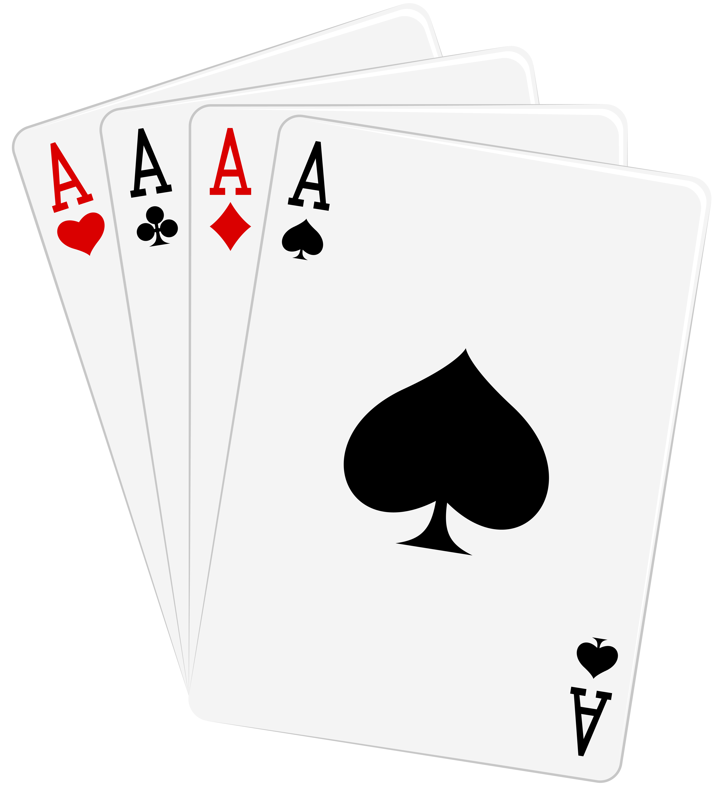

# Texas Hold'em Game Analytics

## Scope

The idea behind this project is to provide a tool for assisting the player during a Poker game,
particularly by analyzing in real time a hand given a user input and thus helping the player to improve his strategy and decision making by offering probability based predictions.

**N.B.** It's not meant as a GTO like [PioSOLVER](https://piosolver.com/) or [b-inary](https://github.com/b-inary)'s [WASM](https://wasm-postflop.pages.dev/). The assistance given is much less "imperative", and is aimed primarly at players that need to get familiar
with calculating odds and pot odds in real time on recurring hands.

## How to run

Since this program is completely developed in python, if you haven't already done it yet, you need to install and setup python on your system. To do so check my brief [guide](https://github.com/chessparov/chessparov/blob/main/python-setup.md) on the topic, or check the much better and complete [official guide](https://wiki.python.org/moin/BeginnersGuide).

### Suggestions

For an optimal user experience make sure you have all libraries indicated in the [requirements](Requirements.txt) correclty installed and also make sure to install the Azonix font that you can find in the [assets](Assets) directory. To do so:

**Windows:**  Extract the file, double click it and press install

**Linux:**  Extract the file and copy it in the directory `usr/share/fonts/opentype`. If it doesn't exist, just create it. 
  Please note, since it's a sys directory, you'll most likely need root privileges. To simply obtain them, create the dir in terminal by running `sudo mkdir usr/share/fonts/opentype` and then move the file in `mv path/to/Azonix.otf usr/share/fonts/opentype`

To run the program, either open PokerMain.py in your IDE, or run from terminal:

**Windows:** ``$ python PokerMain.py``

**Linux:** ``$ python3 PokerMain.py``

## Code Structure
The program is built using OOP paradigms. Each entity has its own class and methods and custom exceptions are added to improve error handling.

- ### TCard
  Each card has a value and a suit and is represented by a name obtained glueing together its     value and its suit (e.g. "JH", "qs", "Ad", "3c").
  Altough only certain values are accepted (see TDeck), technically speaking the only rule you have to follow when creating an instance TCard, is to provide a name of exactly two characters (with the sole exceptions of all cards with value 10, as it's possible to use both "T" and "10" as the value, with "10" promptly converted to "T").
  
  Class methods are:
  - **getName:**  _Returns a two-character string containing object attributes value + suit_
  - **getValue:**  _Returns the value as a char_
  - **getSuit:**  _Returns the suit as a char_
  
- ### TDeck
  A container for the allowed cards according to the current game rules.
  Since we're interested in analyzing a "Texas Hold'em" game, the cards are stored in a 4x13 matrix (4 suits, 13 values), but obviously we can change it to fit different card games.
  
  Class methods are:
  - **addCard:**  _Given a valid object TCard, adds it to the deck_
  - **removeCard:**  _Checks if a card is present and removes it from the deck_
  - **getCards:**  _Returns the numpy array containig all current cards_
  - **getValues:**  _Returns the list of allowed values_
  - **getSuits:**  _Returns the list of allowed suits_

  There are other methods, but are of much smaller impact and have way less use cases, so have been omitted.

  **Accepted values are:**
    - (2, 3, 4, 5, 6, 7, 8, 9, T, J, Q, K, A)

  **Accepted suits are:**
    - (S, H, D, C)
    
- ### TStdDeck
  Simply a child class of TDeck from whom inherites all methods and attributes, but it's been prefilled with all 52 possible cards by default. Very useful for all the probability calculations later occuring.
  
- ### THand
  Still in costruction, but as of now accepts user inputs and, by setting a deck and the current number of players, returns step-by-step the current value of your hand and the odds of improving it by the next reveal of new cards.

## Roadmap

Detailed roadmap [here](https://github.com/chessparov/Poker/blob/main/RoadMap.md). Contributions are highly appreciated.
